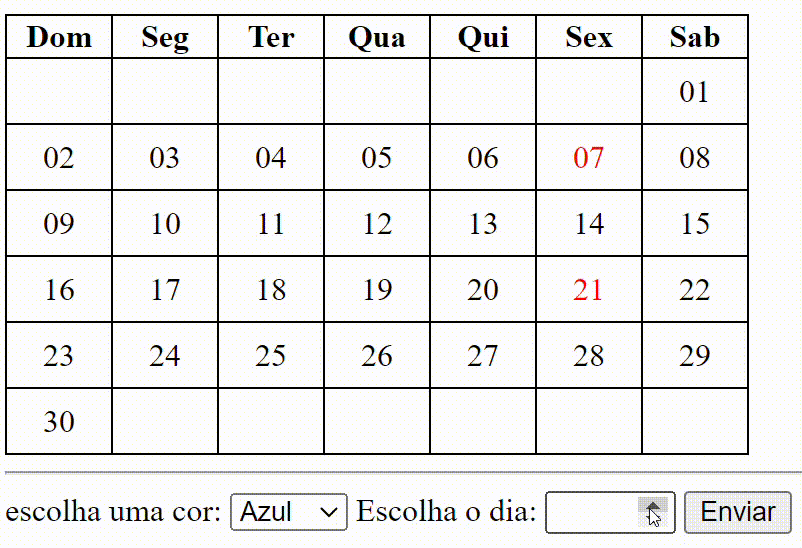

## 📆 Calendário Interativo 
Este é um simples projeto de calendário web que permite ao usuário escolher uma cor e um dia do mês para destacar no calendário.

📈 ÍNDICE

* [Calendário interativo](https://github.com/Witoriabeatriz/Calendario-interativo/tree/main#%EF%B8%8F-capa-do-projeto)

* [Capa do projeto](https://github.com/Witoriabeatriz/Calendario-interativo/tree/main#%EF%B8%8F-capa-do-projeto)
  
* [Sobre o projeto](https://github.com/Witoriabeatriz/Calendario-interativo/tree/main#-sobre-o-projeto)  

* [Recursos](https://github.com/Witoriabeatriz/Calendario-interativo/tree/main#-recursos)

* [Composição do projeto](https://github.com/Witoriabeatriz/Calendario-interativo/blob/main/README.md#%EF%B8%8F-composi%C3%A7%C3%A3o-do-projeto)
 
* [Tecnologias Utilizadas](https://github.com/Witoriabeatriz/Calendario-interativo/tree/main#tecologias-utilizadas)  

* [Ferramentas Utilizadas](https://github.com/Witoriabeatriz/Calendario-interativo/tree/main#-ferramentas-utilizadas)

 * [Instruções de uso](https://github.com/Witoriabeatriz/Calendario-interativo/tree/main#-instru%C3%A7%C3%B5es-de-uso)

* [Funcionalidades](https://github.com/Witoriabeatriz/Calendario-interativo/tree/main#funcionalidades)
  
* [Personalização](https://github.com/Witoriabeatriz/Calendario-interativo/tree/main#-personaliza%C3%A7%C3%A3o)
 
* [Fontes consultadas](https://github.com/Witoriabeatriz/Calendario-interativo/tree/main#-fontes-consultadas)
 
* [Autor](https://github.com/Witoriabeatriz/Calendario-interativo/tree/main#-autor)  

## 🖥️ Capa do projeto

## 📌 Sobre o projeto 
Este é um simples projeto de calendário web que permite ao usuário escolher uma cor e um dia do mês para destacar no calendário;
Foi desenvolvido no primeiro trimestre do segundo ano do ensino médio integrado em 2023 nas aulas de PROGRAMAÇÃO WEB I ministradas pelo professor Leonardo Rocha Na instituição Marista Escola Social Irmão Acácio.

## 📝 Recursos
- Visualização de um calendário com os dias do mês;
- Opção de escolher uma cor para destacar um dia no calendário;
- Entrada para selecionar o dia do mês;
- Botão para aplicar a cor selecionada ao dia escolhido.

## 🛠️ Composição do projeto 
O projeto conta com 3  arquivos fundamentais 

* index.html
* table.css
* table.js

## 🤖 Tecologias utilizadas
- HTML5;
- CSS;
- JavaScript.

## ⌨ Ferramentas utilizadas
- git; 
- git hub;
- visual Studio Code.
 
## ✔ Instruções de Uso
- Abra o arquivo `index.html` em seu navegador;
- Escolha uma cor na lista suspensa "Escolha uma cor";
- Digite o número do dia que você deseja destacar no campo "Escolha o dia";- Clique no botão "Aplicar" para colorir o dia selecionado no -calendário.
 
## 👾 Funcionalidades
Adicionar cor aos dias no calendario;
Tabela de cores:
* 💙Azul
* 💚Verde
* 💗Rosa
* 💜Roxo

## 🖌 Personalização
Você pode personalizar o calendário ajustando o arquivo `table.css` para alterar o estilo visual e o arquivo `table.js` para modificar o comportamento e a lógica do calendário.

## 🔗 Fontes consultadas
1.[Chat gpt](https://chat.openai.com/) - Como fazer um bom README
2.[GitHub Docs](https://docs.github.com/pt/get-started/writing-on-github/getting-started-with-writing-and-formatting-on-github/basic-writing-and-formatting-syntax) - Sintaxe básica de gravação e formatação no GitHub
3.[Alura](https://www.alura.com.br/artigos/escrever-bom-readme) - Como escrever um README incrível no seu Github  
4.[Dio.me](https://www.dio.me/articles/personalize-o-readme-no-github) - Como inserir imagem no README     

## 🫱🏻‍🫲🏽 Colaboradores

* Professor  
1. [Leonardo](https://github.com/leonardossrocha)
2. [Leonardo.Rocha](https://github.com/leonardoRochaMarista)  

* Amigos/colegas  
1. [Juan](https://github.com/Juanbyluna)
2. [jasminy](https://github.com/jamybr)

## ✒ Autor
Este projeto foi criado por [Witória Beatriz Dos Santos](https://github.com/Witoriabeatriz)
